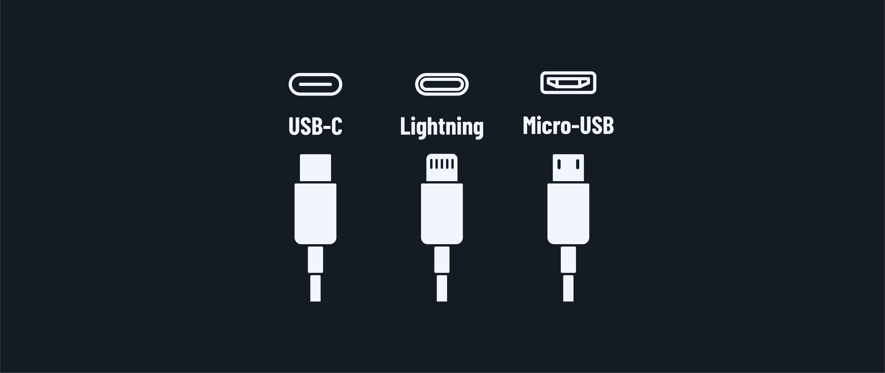
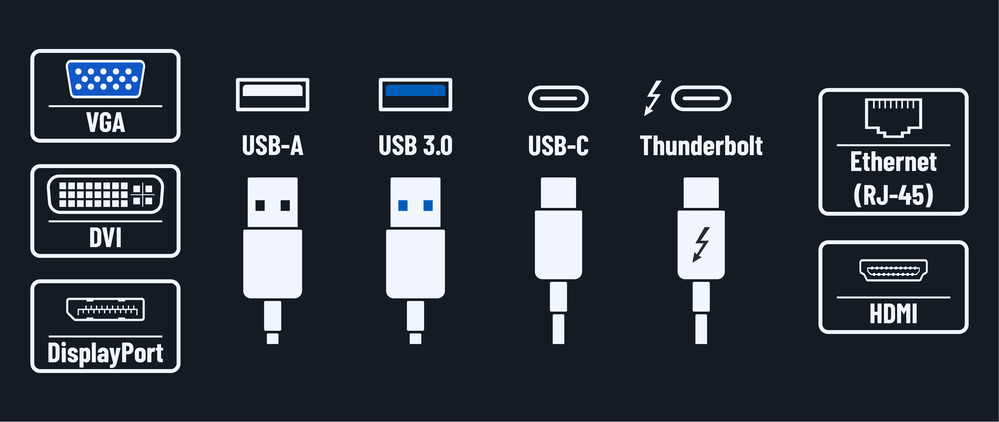
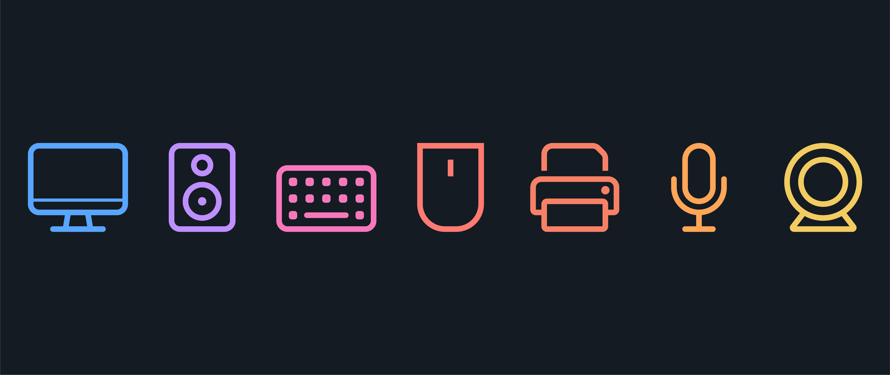

<h1>
  What's Your Setup?
  Discussion: What's Your Setup?
</h1>

**Learning objective:** By the end of this lesson, students will be able to explain their current tech stack and its components, enabling them to better evaluate tech they will encounter in their careers.

## Getting to know your tech

Let's talk about why knowing your way around your own tech setup is helpful. Think of it like knowing what's in your toolbox - when something goes wrong or you need to make changes, you'll know what you're working with.

> 💡 Everything you learn about your setup directly connects to technology you'll need to know for real-life scenarios and technology exams!

  <h2 class="title">Your mobile device connections</h2>
  5 min

Let's start with something you probably use every day - your phone! Log all of the following, then we'll discuss what you find.

### Ports and connectors to identify

1. Charging port type:

   - USB-C
   - Lightning
   - Micro-USB

2. Audio Connections:

   - 3.5 mm headphone jack
   - USB-C to headphone adapters

### Accessories to check

- How do you charge your phone? Do you charge it wirelessly or use a wire?
- Do you have external batteries or power banks? If you do, what is their mAh (milliamp hours) capacity?
- Do you have a case? If you do, note if it's wireless charging compatible.
- Do you have a screen protector? If you do, is it glass or plastic?

  <h2 class="title">Your laptop or desktop connections</h2>
  15 min

Time to check out your computer's connectivity options! Log the type and number of each port on your computer, and we'll discuss!

### Common ports to map out

1. USB ports

   - USB-A and USB 3.0 ports are rectangular. USB 3.0 ports will have a blue insert.
   - USB-C ports are oval.

   Note any special markings, for example, SS for SuperSpeed or a lightning bolt for Thunderbolt.

2. Display outputs

   - HDMI is common across laptops and desktops.
   - DisplayPort is often found on gaming or workstation setups.
   - VGA ports are older, and are typically blue.
   - DVI ports are white or blue with pins. There are a wide variety of DVI sub-types, so yours may not look exactly like the graphic above.

3. Network connections

   - Note any Ethernet (RJ-45) ports.
   - Does the device have Wi-Fi capabilities such as 802.11a/g/n/ac or Wi-Fi 6, 6E, or 7? You may need to check your system settings for this.
   - Note if the device has Bluetooth. If you do, determine the Bluetooth version.

4. Anything else?

   Take note of anything you've found that's not listed above. Try to identify it or share it with the group.

  <h2 class="title">Peripherals party!</h2>
  10 min

What's connected to your computer? Log the following details about your computer's input and output devices, and we'll talk briefly about what you've found.

### Input devices

- Keyboards can be almost endlessly customized. Take note of your keyboard's features, including:
  - Is it TKL (TenKeyLess)?
  - Is it mechanical or membrane?
  - Is it wired or wireless?
  - Does it have a backlight?
  - Does it have a unique key layout or size?
  - Are the keys split up in some way for comfort, or are they collected together?
- Note if you use a mouse or trackpad. Include its connection method.
- Document the Webcam type (external or internal) and resolution.
- Determine your microphone setup.

### Output devices

Take note of all of the following:

- Monitor connections and resolutions.
- Speaker/headphone setup.
- Printer type, such as laser or inkjet, and its connection method.
